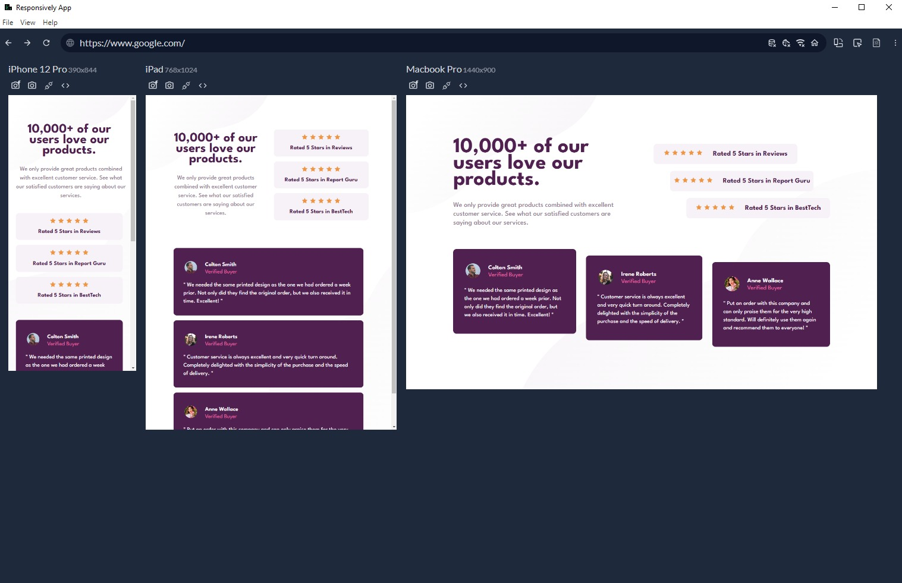

Live Site: https://rc-fm-social-proof-section-challenge.netlify.app/

# Frontend Mentor - Social proof section solution

This is a solution to the [Social proof section challenge on Frontend Mentor](https://www.frontendmentor.io/challenges/social-proof-section-6e0qTv_bA). Frontend Mentor challenges help you improve your coding skills by building realistic projects. 

## Table of contents

- [Overview](#overview)
- [Solution Screenshot](#solutionscreenshot)
- [My process](#my-process)
  - [Built with](#built-with)
  - [What I learned](#what-i-learned)
- [Author](#author)

**Note: Delete this note and update the table of contents based on what sections you keep.**

## Overview

Frontend Mentor challenge, a Social proof section with the following design:

### SolutionScreenshot

## My process

### Built with

- Semantic HTML5 markup
- CSS custom properties
- Flexbox
- Grid

### What I learned

This project helped to remember how to use Media Queries.
It also happened to be the first time I used svgs as background instead of an image (which I would usually declare within a CSS style sheet).

## Author

- Frontend Mentor - [@reginacachoa](https://www.frontendmentor.io/profile/reginacachoa)
